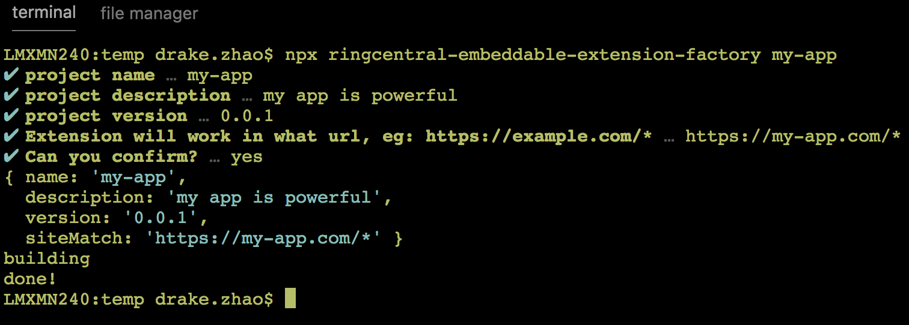

# ringcentral-embeddable-extension-factory

[](https://travis-ci.org/ringcentral/ringcentral-embeddable-extension-factory)


Cli tool to create a [RingCentral Embeddable](https://github.com/ringcentral/ringcentral-embeddable) Chrome/Firefox extension for CRM sites.



## Quick start

```bash
# make sure you have npm@5.2+ installed, and Linux and mac OS only
npx ringcentral-embeddable-extension-factory my-app
# or install it first
# npm i -g ringcentral-embeddable-extension-factory && reef my-app
# then carefully answer all questions, then the my-app folder will be create
cd my-app

# Then just follow my-app/README.md's instruction
```

## Tutorial

Visit our [detailed tutorial](https://ringcentral-tutorials.github.io/build-chrome-ringcentral-widgets-extension-for-crm).

## Video

[https://youtu.be/okwzLs4T5zc](https://youtu.be/okwzLs4T5zc)

## Realworld examples

- [pipedrive-embeddable-ringcentral-phone-nospa](https://github.com/ringcentral/pipedrive-embeddable-ringcentral-phone-nospa)
- [pipedrive-embeddable-ringcentral-phone-spa](https://github.com/ringcentral/pipedrive-embeddable-ringcentral-phone-spa)
- [hubspot-embeddable-ringcentral-phone (spa)](https://github.com/ringcentral/hubspot-embeddable-ringcentral-phone)
- [insightly-embeddable-ringcentral-phone (spa)](https://github.com/ringcentral/insightly-embeddable-ringcentral-phone)
- [redtail-embeddable-ringcentral-phone (non spa)](https://github.com/ringcentral/redtail-embeddable-ringcentral-phone)

## License

MIT
